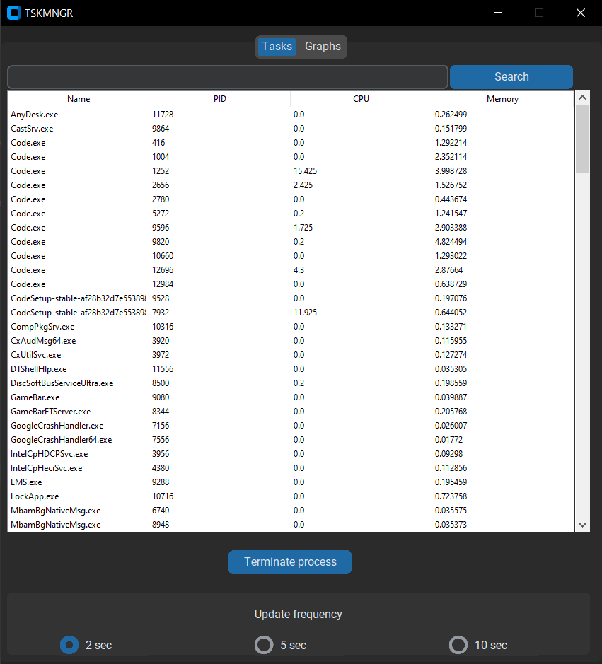

## 1_1
Диспетчер задач

## Листинг 1_1
```Py
import customtkinter as CTk
from CTkMessagebox import CTkMessagebox
from tkinter import ttk
import psutil
import matplotlib.pyplot as plt
from matplotlib.backends.backend_tkagg import FigureCanvasTkAgg


class App(CTk.CTk):
    def __init__(self):
        super().__init__()

        self.resizable(height=False, width=False)
        self.title("TSKMNGR")
        self.geometry('680x760')

        # Tabview
        CTk.set_appearance_mode("Dark")
        self.tabview = CTk.CTkTabview(master=self)
        self.tabview.add('Tasks')
        self.tabview.add('Graphs')
        self.tabview.pack(fill="both")

        # Вводим необходимые переменные
        self.time = 0
        self.timer = CTk.IntVar(value=1)
        self.sort_col = 0
        self.sort_type = str
        self.reverse = False
        self.selected_item = None
        self.new_network_received = None
        self.new_network_sent = None
        self.procs = []
        self.x = []
        self.y_cpu = []
        self.y_mem = []
        self.y_disk = []
        self.y_network_sent = []
        self.y_network_received = []
        self.initial_network_sent = psutil.net_io_counters().bytes_sent / 1024
        self.initial_network_received = psutil.net_io_counters().bytes_recv / 1024

        # Создаём список процессов
        self.load_processes()

        # Scrollbar
        self.scrollbar = ttk.Scrollbar(self.tabview.tab('Tasks'), orient="vertical")
        self.scrollbar.grid(column=2, row=1, sticky='ns')

        # Treeview
        self.tree = ttk.Treeview(self.tabview.tab('Tasks'), columns=("Name", "PID", "CPU", "Memory"),
                                 yscrollcommand=self.scrollbar.set,
                                 show="headings", height=30)
        self.tree.heading("Name", text="Name", command=lambda: self.sort(0, str, False))
        self.tree.heading("PID", text="PID", command=lambda: self.sort(1, int, False))
        self.tree.heading("CPU", text="CPU", command=lambda: self.sort(2, float, False))
        self.tree.heading("Memory", text="Memory", command=lambda: self.sort(3, float, False))
        self.tree.grid(column=0, row=1, columnspan=2, sticky='nsew')
        self.tree.bind("<<TreeviewSelect>>", self.item_selected)
        self.radiobutton_frame = CTk.CTkFrame(self.tabview.tab('Tasks'))
        self.radiobutton_frame.grid(column=0, row=3, columnspan=3, sticky='ew')
        self.label_radio_group = CTk.CTkLabel(master=self.radiobutton_frame, text="Update frequency")
        self.label_radio_group.grid(row=0, column=0, columnspan=3, padx=10, pady=10, sticky='ew')
        self.radio_button_1 = CTk.CTkRadioButton(master=self.radiobutton_frame, variable=self.timer,
                                                 value=2, text='2 sec')
        self.radio_button_1.grid(row=1, column=0, padx=60,sticky='ew')
        self.radio_button_2 = CTk.CTkRadioButton(master=self.radiobutton_frame, variable=self.timer,
                                                 value=5, text='5 sec')
        self.radio_button_2.grid(row=1, column=1, padx=60,sticky='ew')
        self.radio_button_3 = CTk.CTkRadioButton(master=self.radiobutton_frame, variable=self.timer,
                                                 value=10, text='10 sec')
        self.radio_button_3.grid(row=1, column=2, padx=60, sticky='ew')
        # Связываем полосу прокрутки с Treeview
        self.scrollbar.config(command=self.tree.yview)  # Метод yview управляет вертикальной прокруткой в Treeview.

        # Кнопка удаления
        self.delete_button = CTk.CTkButton(self.tabview.tab('Tasks'), text="Terminate process",
                                           command=self.terminate_process)
        self.delete_button.grid(row=2, column=0, columnspan=2, pady=20)

        # Поле поиска
        self.search_entry = CTk.CTkEntry(self.tabview.tab('Tasks'), width=500)
        self.search_button = CTk.CTkButton(self.tabview.tab('Tasks'), text='Search', command=self.search)
        self.search_button.grid(row=0, column=1)
        self.search_entry.grid(row=0, column=0)

        # Графики
        self.figure, (self.ax1, self.ax2, self.ax3, self.ax4) = plt.subplots(4, 1, figsize=(7, 9))
        plt.subplots_adjust(hspace=1)
        self.ax1.set_xlabel('Time')
        self.ax1.set_ylabel('Percentage (%)')
        self.ax1.set_title('CPU')
        self.ax2.set_xlabel('Time')
        self.ax2.set_ylabel('Percentage (%)')
        self.ax2.set_title('Memory')
        self.ax3.set_xlabel('Time')
        self.ax3.set_ylabel('Percentage (%)')
        self.ax3.set_title('Disk')
        self.ax4.set_xlabel('Time')
        self.ax4.set_ylabel('Kb/s')
        self.ax4.set_title('Network')
        self.canvas = FigureCanvasTkAgg(self.figure, self.tabview.tab('Graphs'))
        self.canvas.get_tk_widget().pack(fill='both')

        # Создание линий графиков
        self.line_cpu, = self.ax1.plot(self.x, self.y_cpu)
        self.line_mem, = self.ax2.plot(self.x, self.y_mem)
        self.line_disk, = self.ax3.plot(self.x, self.y_disk)
        self.line_network_sent, = self.ax4.plot(self.x, self.y_network_sent, label='sent')
        self.line_network_received, = self.ax4.plot(self.x, self.y_network_received, label='received')
        plt.legend()
        self.flag = True
        self.populate_treeview()
        self.update()

    def item_selected(self, event):
        self.selected_item = self.tree.item(self.tree.selection())['values'][:2]

    def load_processes(self):
        self.procs = []
        pids = psutil.pids()
        for pid in pids:
            try:
                self.procs.append(psutil.Process(pid))
            except (psutil.NoSuchProcess, psutil.AccessDenied, psutil.ZombieProcess):
                pass

    def populate_treeview(self):
        try:
            for proc in self.procs:
                self.tree.insert("", "end", values=(
                    proc.name(),
                    proc.pid,
                    proc.cpu_percent(),
                    proc.memory_percent()
                ))
        except psutil.NoSuchProcess:
            pass

    def update(self):
        if self.flag:
            self.x.append(self.time)
            if max(self.x) >= 60:
                self.flag = False
            self.time += self.timer.get()
        self.new_network_sent = psutil.net_io_counters().bytes_sent / 1024
        self.new_network_received = psutil.net_io_counters().bytes_recv / 1024
        self.y_cpu.append(psutil.cpu_percent())
        self.y_mem.append(psutil.virtual_memory().percent)
        self.y_disk.append(psutil.disk_usage('/').percent)
        self.y_network_sent.append(self.new_network_sent - self.initial_network_sent)
        self.y_network_received.append(self.new_network_received - self.initial_network_received)
        self.initial_network_sent = self.new_network_sent

        self.line_cpu.set_data(self.x, self.y_cpu)
        self.line_mem.set_data(self.x, self.y_mem)
        self.line_disk.set_data(self.x, self.y_disk)
        self.line_network_sent.set_data(self.x, self.y_network_sent)
        self.line_network_received.set_data(self.x, self.y_network_received)
        if max(self.x) >= 60:
            self.y_cpu.pop(0)
            self.y_mem.pop(0)
            self.y_disk.pop(0)
            self.y_network_sent.pop(0)
            self.y_network_received.pop(0)

        # Построение графиков
        self.ax1.autoscale_view()
        self.ax1.set_xlim(0, 60)
        self.ax1.set_ylim(0, 100)
        self.ax2.autoscale_view()
        self.ax2.set_xlim(0, 60)
        self.ax2.set_ylim(0, 100)
        self.ax3.autoscale_view()
        self.ax3.set_xlim(0, 60)
        self.ax3.set_ylim(0, 100)
        self.ax4.autoscale_view()
        self.ax4.set_xlim(0, 60)
        self.ax4.relim()
        self.canvas.draw()

        # Обновление значений процессов
        try:
            for i, p in enumerate(self.procs):
                self.tree.item(self.tree.get_children()[i],
                               values=(p.name(),
                                       p.pid,
                                       p.cpu_percent(interval=0) / psutil.cpu_count(),
                                       round(p.memory_percent(), 6)
                                       )
                               )
        except psutil.NoSuchProcess:
            pass

        # Сортировка по столбцам
        self.sort(self.sort_col, self.sort_type, False)

        # Сохранение выделенного объекта
        if self.selected_item is not None:
            for child in self.tree.get_children():
                if self.tree.item(child)["values"][:2] == self.selected_item:
                    self.tree.selection_set(child)
                    break
        self.after(self.timer.get()*1000, self.update)

    def search(self):
        query = self.search_entry.get()
        for child in self.tree.get_children():
            if query.lower() in self.tree.item(child)['values'][0].lower():
                self.selected_item = self.tree.item(child)['values'][:2]
                self.tree.selection_set(child)
                break
        self.load_processes()

    def terminate_process(self):
        try:
            pid = self.selected_item[1]
            p = psutil.Process(pid)
            p.kill()
            self.procs.remove(p)
            for child in self.tree.get_children():
                if self.tree.item(child)["values"][:2] == self.selected_item:
                    self.tree.delete(child)
                    break
            self.load_processes()
        except psutil.NoSuchProcess:
            pass
        except psutil.AccessDenied:
            CTkMessagebox(title="Error", message="Terminating a system process may cause system instability.",
                          icon="cancel", option_1='Cancel')

    def sort(self, col, data_type, source):
        if source:
            self.reverse = not self.reverse
        l = [(self.tree.set(k, col), k) for k in self.tree.get_children('')]
        l.sort(key=lambda t: data_type(t[0]), reverse=self.reverse)
        for index, (_, k) in enumerate(l):
            self.tree.move(k, "", index)
        self.tree.heading(col, command=lambda: self.sort(col, data_type, True))
        self.sort_col = col
        self.sort_type = data_type


if __name__ == "__main__":
    app = App()
    app.mainloop()
```
### Мой результат выполнения программы


### Пояснение
При запуске открывается окно программы. В виджет Treeview записываются все процессы. Процессы можно сортировать нажатием на столбец с необходимым критерием, при повторном нажатии сработает обратная сортировка. Кнопка "Terminate process" закрывает процесс и удаляет его из таблицы. В поле Entry вводится имя процесса, который мы хотим найти. При нажатии кнопки "Search" в таблице выделяется процесс с именем, введённым в поле Entry. Во вкладке Graphs отображаются графики загруженности CPU, Диска, памяти и сети. Менять частоту обновления процессов можно с помощью кнопок RadioButtons внизу окна.
