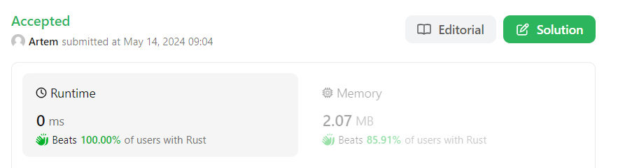

## 1_1
Length of last word

## Листинг 1_1
```rs
fn length_of_last_word(s: &str) -> i32 {
    let mut count = 0;
    
    for chr in s.trim_end().chars().rev() {
        if chr == ' ' {
            break
        } else {
            count += 1;
        }
    }
    
    count
}

fn main(){
    let s:&str = "Abra Kadabra ";
    let r = length_of_last_word(s);
    println!("{}", r)
}
```

### Результат выполнения программы

### Пояснение
При запуске создаётся переменная-счётчик. После запускается цикл для каждого сивмола из списка всех символов последнего слова. Если символ - проблел, цикл завершается, иначе к счётчику прибавляется 1 и цикл продолжается.

