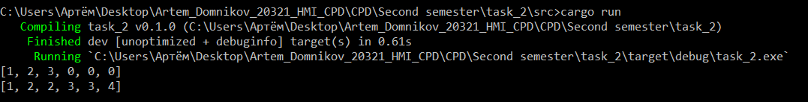

## 1_1
merge

## Листинг 1_1
```rs
fn merge(nums1: &mut Vec<i32>, m: i32, nums2: &mut Vec<i32>, n: i32) {
    nums1.truncate(m as usize);
    nums2.truncate(n as usize);
    nums1.append(nums2);
    nums1.sort();
}

fn main(){
    let mut nums1 = vec![1,2,3,0,0,0];
    let m = 3;
    println!("{:?}", nums1);
    let mut nums2 = vec![2,3,4];
    let n = 3;
    merge(&mut nums1, m, &mut nums2, n);
    println!("{:?}", nums1);
}
```

### Результат выполнения программы

### Пояснение
Даны два целочисленных массива nums1 и nums2, отсортированные в порядке неубывания, и два целых числа m и n, представляющие количество элементов в nums1 и nums2.
nums1 имеет длину m + n, где первые m элементов обозначают элементы, которые следует объединить, а последние n элементов имеют значение 0 и их следует игнорировать. nums2 имеет длину n. При запуске массивы nums1 и nums2 обрезаются до размера m и n сответственно, к массиву nums1 добавляется массив nums2 и сортируется.