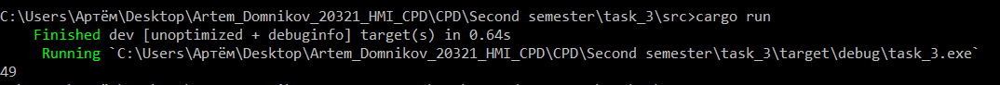

## 1_1
max area
## Листинг 1_1
```rs
fn max_area(height: Vec<i32>) -> i32 {
    let (mut left, mut right) = (0, height.len() - 1);
    let mut max_area = 0;
    while left < right {
        let width: i32 = (right - left) as i32;
        let min_height = std::cmp::min(height[left], height[right]);
        let current_area = width * min_height;
        max_area = std::cmp::max(max_area, current_area);

        // Move the pointer of the shorter line inward
        if height[left] < height[right] {
            left += 1;
        } else {
            right -= 1;
        }
    }

    // Return the maximum area found
    max_area
}
fn main(){
    let s:&str = "Abra Kadabra ";
    let r = length_of_last_word(s);
    println!("{}", r)
}
```

### Результат выполнения программы

### Пояснение
При запуске создаётся переменная-счётчик. После запускается цикл для каждого сивмола из списка всех символов последнего слова. Если символ - проблел, цикл завершается, иначе к счётчику прибавляется 1 и цикл продолжается.
