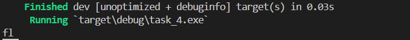

## 1_1
longest common prefix
## Листинг 1_1
```rs
pub fn longest_common_prefix(mut strs: Vec<String>) ->String {
    strs.sort();
    let mut prefix = String::new();
    let mut first_word = &strs[0];
    let mut last_word = &strs[1];
    for i in 0..std::cmp::min(first_word.len(), last_word.len()){
        let first = first_word.chars().nth(i).unwrap();
        let last = last_word.chars().nth(i).unwrap();
        if first != last{
            break
        }
        else{
            prefix.push(first)
    }
}
return prefix;
}
fn main(){
    let mut strs = vec![String::from("flower"),String::from("flow"),String::from("flight")];
    let prefix = longest_common_prefix(strs);
    println!("{}", prefix);
}
```

### Результат выполнения программы

### Пояснение
Функция для поиска самой длинной строки общего префикса среди массива строк.
Сначала сортируем приходящий вектор строк, создаём переменные для префикса, первого слова и второго слова. В цикле сравниваем буквы в словах до длинны самого короткого слова. обновляем значение переменной префикса.
Если общего префикса нет, возвращает пустую строку «»