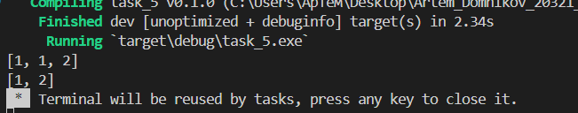

## 1_1
Remove duplicates

## Листинг 1_1
```rs
pub fn remove_duplicates(nums: &mut Vec<i32>) -> i32 {
    nums.sort();
    nums.dedup();
    return nums.len() as i32;
}

fn main(){
    let mut nums = vec![1,1,2];
    println!("{:?}", nums);
    remove_duplicates(&mut nums);
    println!("{:?}", nums);
}
```

### Результат выполнения программы
