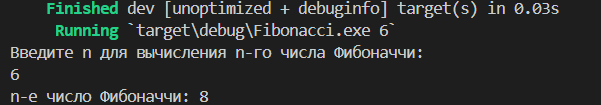

## Fibonacci

## Листинг 1_1
```rs
use std::io;

fn fibonacci(n: u32) -> u32 {
   if n == 0{
    return 0
   }
   else if n == 1{
    return 1
   }
   else{
    return fibonacci(n - 1) + fibonacci(n - 2)
   }
}

fn main() {
    println!("Введите n для вычисления n-го числа Фибоначчи:");
    let mut input = String::new();
    io::stdin().read_line(&mut input).expect("Не удалось прочитать строку");
    let n: u32 = input.trim().parse().expect("Пожалуйста, введите целое число");
    let result = fibonacci(n);
    println!("n-е число Фибоначчи: {}", result);
}
```
## Результат работы программы
