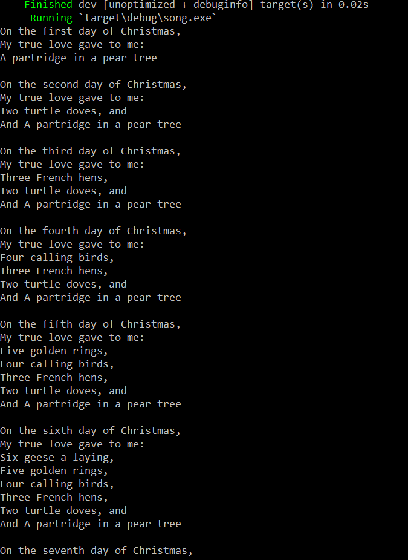
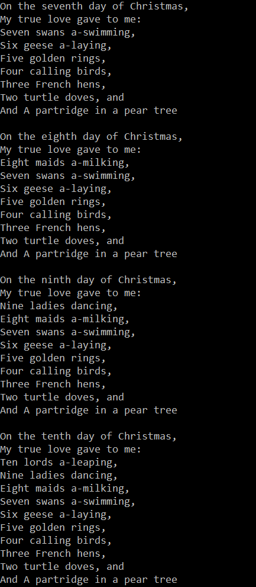
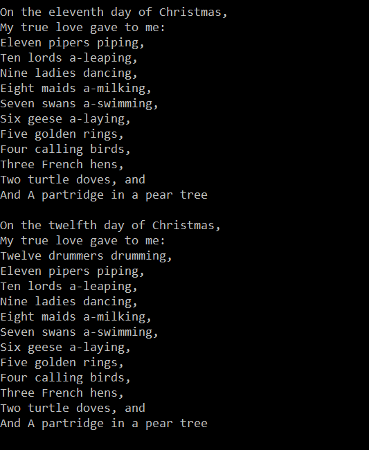

## Song
## Листинг 1_1
```rs
fn main() {
    let days = [
        "first", "second", "third", "fourth", "fifth", "sixth", "seventh", "eighth", "ninth", "tenth",
        "eleventh", "twelfth",
    ];
    let gifts = [
        "A partridge in a pear tree",
        "Two turtle doves, and",
        "Three French hens,",
        "Four calling birds,",
        "Five golden rings,",
        "Six geese a-laying,",
        "Seven swans a-swimming,",
        "Eight maids a-milking,",
        "Nine ladies dancing,",
        "Ten lords a-leaping,",
        "Eleven pipers piping,",
        "Twelve drummers drumming,",
    ];
    for day in 0..12 {
        println!("On the {} day of Christmas,", days[day]);
        println!("My true love gave to me:");
        
        for gift_day in (0..=day).rev() {
            if gift_day == 0 && day != 0 {
                print!("And ");
            }
            println!("{}", gifts[gift_day]);
        }
        println!();
    }
}
```
## Результат работы программы


