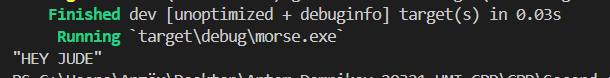

## 1_1
Decode morse code
## Листинг 1_1
```rs
fn decode_morse(encoded: &str) -> String {
    let mut MORSE_CODE: HashMap<String, String> = HashMap::new();

        morse_code.insert(String::from(".-"), String::from("A"));
        morse_code.insert(String::from("-..."), String::from("B"));
        morse_code.insert(String::from("-.-."), String::from("C"));
        morse_code.insert(String::from("-.."), String::from("D"));
        morse_code.insert(String::from("."), String::from("E"));
        morse_code.insert(String::from("..-."), String::from("F"));
        morse_code.insert(String::from("--."), String::from("G"));
        morse_code.insert(String::from("...."), String::from("H"));
        morse_code.insert(String::from(".."), String::from("I"));
        morse_code.insert(String::from(".---"), String::from("J"));
        morse_code.insert(String::from("-.-"), String::from("K"));
        morse_code.insert(String::from(".-.."), String::from("L"));
        morse_code.insert(String::from("--"), String::from("M"));
        morse_code.insert(String::from("-."), String::from("N"));
        morse_code.insert(String::from("---"), String::from("O"));
        morse_code.insert(String::from(".--."), String::from("P"));
        morse_code.insert(String::from("--.-"), String::from("Q"));
        morse_code.insert(String::from(".-."), String::from("R"));
        morse_code.insert(String::from("..."), String::from("S"));
        morse_code.insert(String::from("-"), String::from("T"));
        morse_code.insert(String::from("..-"), String::from("U"));
        morse_code.insert(String::from("...-"), String::from("V"));
        morse_code.insert(String::from(".--"), String::from("W"));
        morse_code.insert(String::from("-..-"), String::from("X"));
        morse_code.insert(String::from("-.--"), String::from("Y"));
        morse_code.insert(String::from("--.."), String::from("Z"));
        morse_code.insert(String::from("-----"), String::from("0"));
        morse_code.insert(String::from(".----"), String::from("1"));
        morse_code.insert(String::from("..---"), String::from("2"));
        morse_code.insert(String::from("...--"), String::from("3"));
        morse_code.insert(String::from("....-"), String::from("4"));
        morse_code.insert(String::from("....."), String::from("5"));
        morse_code.insert(String::from("-...."), String::from("6"));
        morse_code.insert(String::from("--..."), String::from("7"));
        morse_code.insert(String::from("---.."), String::from("8"));
        morse_code.insert(String::from("----."), String::from("9"));
        morse_code.insert(String::from(".-.-.-"), String::from("."));
        morse_code.insert(String::from("--..--"), String::from(","));
        morse_code.insert(String::from("..--.."), String::from("?"));
        morse_code.insert(String::from(".----."), String::from("'"));
        morse_code.insert(String::from("-.-.--"), String::from("!"));
        morse_code.insert(String::from("-..-."), String::from("/"));
        morse_code.insert(String::from("-.--."), String::from("("));
        morse_code.insert(String::from("-.--.-"), String::from(")"));
        morse_code.insert(String::from(".-..."), String::from("&"));
        morse_code.insert(String::from("---..."), String::from(":"));
        morse_code.insert(String::from("-.-.-."), String::from(";"));
        morse_code.insert(String::from("-...-"), String::from("="));
        morse_code.insert(String::from(".-.-."), String::from("+"));
        morse_code.insert(String::from("-....-"), String::from("-"));
        morse_code.insert(String::from("..--.-"), String::from("_"));
        morse_code.insert(String::from(".-..-."), String::from("\""));
        morse_code.insert(String::from("...-..-"), String::from("$"));
        morse_code.insert(String::from(".--.-."), String::from("@"));
        morse_code.insert(String::from("...---..."), String::from("SOS"));

    let mut decoded_message = String::new();
    encoded.trim();
    let mut words:Vec<&str> = encoded.split("   ").collect();
    for word in words{
        let mut letters:Vec<&str> = word.split(" ").collect();
        for letter in letters{
            if letter != ""{
            let mut decoded_letter = MORSE_CODE.get(letter).unwrap();
            decoded_message += decoded_letter;
            }
        }
    decoded_message+=" "
    }
return  String::from(decoded_message.trim());
}

pub fn main() {
    let message = ".... . -.--   .--- ..- -.. .";
    let mut message = decode_morse(&message);
    println!("{:?}", message.trim())
}
```

### Результат выполнения программы

