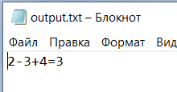

## 1_1
find solution

## Листинг 1_1
```rs
use std::fs::File;
use std::io::{self, BufRead, BufReader, Write};

fn find_solution(index: usize, current_sum: i64, expression: String, numbers: &[i64],target: i64,) -> Option<String> {
    if index == numbers.len() {
        if current_sum == target {
            return Some(expression + &format!("={}", target));
        } else {
            return None;
        }
    }

    // Пробуем добавить знак '+'
    if let Some(result) = find_solution(index + 1,current_sum + numbers[index],expression.clone() + &format!("+{}", numbers[index]), numbers, target,) {
        return Some(result);
    }

    // Пробуем добавить знак '-'
    if let Some(result) = find_solution(index + 1,current_sum - numbers[index],expression.clone() + &format!("-{}", numbers[index]),numbers,target,) {
        return Some(result);
    }

    None
}

fn main() -> io::Result<()> {
    let file = File::open("input.txt")?;
    let reader = BufReader::new(file);

    for line in reader.lines() {
        let line = line?;
        let parts: Vec<&str> = line.split_whitespace().collect();
        let n: usize = parts[0].parse().unwrap();
        let mut numbers: Vec<i64> = Vec::with_capacity(n);
        for i in 1..=n {
            numbers.push(parts[i].parse().unwrap());
        }
        let s: i64 = parts[n + 1].parse().unwrap();

        if let Some(solution) = find_solution(1, numbers[0], numbers[0].to_string(), &numbers, s) {
            let mut output = File::create("output.txt")?;
            writeln!(output, "{}", solution)?;
        } else {
            let mut output = File::create("output.txt")?;
            writeln!(output, "no solution")?;
        }
    }

    Ok(())
}
```

### Результат выполнения программы

