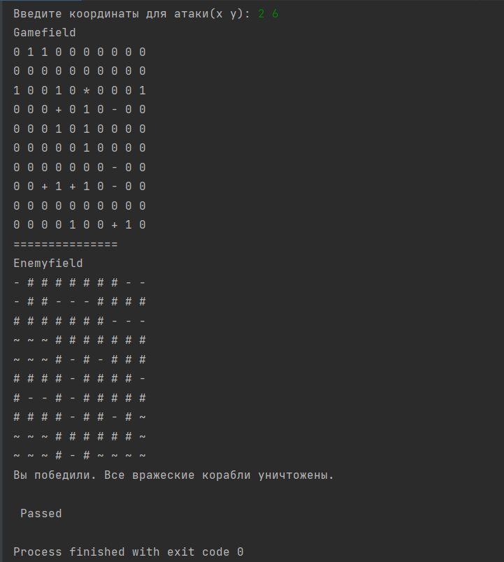

## Морской бой

## Листинг 1_1

```Py
from random import randint, choice


# Возвращает координаты всей зоны вокруг корабля
def get_zone(x: int, y: int, tp: int, length: int, size: int) -> list:
    zone = []
    if tp == 1:
        zone = [[i, j] for i in range(x - 1, x + 1 + length) for j in range(y - 1, y + 2) if
                0 <= i < size and 0 <= j < size]
    elif tp == 2:
        zone = [[i, j] for i in range(x - 1, x + 2) for j in range(y - 1, y + length + 1) if
                0 <= i < size and 0 <= j < size]
    return zone


# Возвращает координаты всех ячеек корабля
def get_self_zone(x, y, tp, length):
    if tp == 1:
        return [[i, y] for i in range(x, x + length)]
    else:
        return [[x, i] for i in range(y, y + length)]


class Ship:
    def __init__(self, length: int, tp: int = 1, x: int = None, y: int = None) -> None:
        self._x = x
        self._y = y
        self._length = length
        self._tp = tp
        self._is_move = True
        self._cells = [1] * length

    # Задаёт начальные координаты корабля
    def set_start_cords(self, x, y) -> None:
        self._x = x
        self._y = y

    # Возвращает начальные координаты корабля
    def get_start_cords(self) -> tuple:
        return self._x, self._y

    # Метод для движения корабля
    def move(self, go) -> None:
        if self._is_move:
            x, y = self.get_start_cords()
            # Горизонтально
            if self._tp == 1:
                x += go
            # Вертикально
            elif self._tp == 2:
                y += go
            self.set_start_cords(x, y)

    # Проверка на столкновение с другим кораблём
    def is_collide(self, ship) -> bool:
        x, y = ship.get_start_cords()
        ship_zone = get_zone(x, y, ship.tp, ship.length, 10)
        self_zone = get_self_zone(self._x, self._y, self._tp, self._length)
        for cords in self_zone:
            if cords in ship_zone:
                return True
        return False

    # Проверка на выход из поля
    def is_out_pole(self, size) -> bool:
        x, y = self.get_start_cords()
        if self._tp == 1:
            if 0 > x or x > size - self._length:
                return True
        if self._tp == 2:
            if 0 > y or y > size - self._length:
                return True
        return False

    def __getitem__(self, item):
        return self._cells[item]

    def __setitem__(self, key, value):
        self._cells.insert(key, value)

    @property
    def tp(self):
        return self._tp

    @property
    def length(self):
        return self._length


class GamePole:
    def __init__(self, size):
        self._size = size
        self._ships = []
        self.field = [[0 for _ in range(self._size)] for _ in range(self._size)]
        self._attacked = []
        self.count = 0

    # Метод для инициализации 10 кораблей
    def init(self):
        self._ships = [
            Ship(4, tp=randint(1, 2)),
            Ship(3, tp=randint(1, 2)),
            Ship(3, tp=randint(1, 2)),
            Ship(2, tp=randint(1, 2)),
            Ship(2, tp=randint(1, 2)),
            Ship(2, tp=randint(1, 2)),
            Ship(1, tp=randint(1, 2)),
            Ship(1, tp=randint(1, 2)),
            Ship(1, tp=randint(1, 2)),
            Ship(1, tp=randint(1, 2))
        ]
        self.update_board()

    # Метод для проверки на столкновение и выход из поля
    def move_check(self, ship, go) -> bool:
        x, y = ship.get_start_cords()
        if ship.tp == 1:
            # Провека на столкновение
            zone = get_zone(x + go, y, ship.tp, ship.length, self._size)
            if go == 1:
                check_length = x + go + ship.length
            else:
                check_length = x + go - 1
            for x_z, y_z in zone:
                if self.field[y_z][x_z] != 0 and x_z == check_length:
                    return False

            # Проверка на выход из поля
            if x + go < 0 or x + go + ship.length > self._size:
                return False

        elif ship.tp == 2:
            # Проверка на столкновение
            zone = get_zone(x, y + go, ship.tp, ship.length, self._size)
            if go == 1:
                check_lenght = y + go + ship.length
            else:
                check_lenght = y + go - 1
            for x_z, y_z in zone:
                if self.field[y_z][x_z] != 0 and y_z == check_lenght:
                    return False

            # Проверка на выход из поля
            if y + go < 0 or y + go + ship.length > self._size:
                return False
        return True

    # Метод для движения всех кораблей по полю
    def move_ships(self) -> None:
        for ship in self._ships:
            go = choice([-1, 1])
            flag = self.move_check(ship, go)
            if flag:
                ship.move(go)
                self.update_board()
            else:
                flag = self.move_check(ship, -go)
                if flag:
                    ship.move(-go)
                    self.update_board()
        self._attacked = []

    # Метод для обновления доски
    def update_board(self) -> None:
        self.field = [[0 for _ in range(self._size)] for _ in range(self._size)]
        for ship in self._ships:
            x, y = self.get_random_cords(ship) if ship._x == ship._y is None else ship.get_start_cords()
            if ship.tp == 1:
                for index, i in enumerate(range(x, x + ship.length)):
                    self.field[y][i] = ship._cells[index]
            elif ship.tp == 2:
                for index, i in enumerate(range(y, y + ship.length)):
                    self.field[i][x] = ship._cells[index]
            ship.set_start_cords(x, y)

    # Метод для определения случайных кординат корабля
    def get_random_cords(self, ship) -> tuple:
        x_rand = 0
        y_rand = 0
        check = False
        while not check:
            check = True
            if ship.tp == 1:
                x_rand, y_rand = (randint(0, self._size - ship.length), randint(0, self._size - 1))
            elif ship.tp == 2:
                x_rand, y_rand = (randint(0, self._size - 1), randint(0, self._size - ship.length))
            zone = get_zone(x_rand, y_rand, ship.tp, ship.length, self._size)
            for x, y in zone:
                if self.field[y][x] == 1:
                    check = False
                    break
        return x_rand, y_rand

    # Возвращает список всех кораблей
    @property
    def get_ships(self):
        return self._ships

    @property
    def size(self):
        return self._size

    # Возвращает доску как двойной кортеж
    def get_pole(self):
        return tuple(tuple(sublist) for sublist in self.field)

    # Выводит доску в консоль
    def show(self):
        self.count = 0
        field = self.field
        for x, y in self._attacked:
            field[y][x] = '*'
        for ship in self._ships:
            if all(b == ship._cells[0] for b in ship._cells) and 2 in ship._cells:
                self.count += 1
            for i, (x, y) in enumerate(get_self_zone(ship._x, ship._y, ship._tp, ship._length)):
                    field[y][x] = ship._cells[i]
        for row in field:
            print(' '.join(map(str, row)))
        print('===============')

    def hidden_show(self):
        self.count = 0
        field = [['~' for _ in range(self._size)] for _ in range(self._size)]
        marker = '+'
        for x, y in self._attacked:
            field[y][x] = '*'
        for ship in self._ships:
            if all(b == ship._cells[0] for b in ship._cells) and 2 in ship._cells:
                for x, y in get_zone(ship._x, ship._y, ship._tp, ship._length, self._size):
                    field[y][x] = '#'
                marker = '-'
                self.count += 1
            for i, (x, y) in enumerate(get_self_zone(ship._x, ship._y, ship._tp, ship._length)):
                if ship._cells[i] == 2:
                    field[y][x] = marker
        for row in field:
            print(' '.join(map(str, row)))
            

class SeaBattle:
    # Инициализация игровых полей
    def __init__(self):
        check = True
        while check:
            try:
                self.size = int(input('Введите размер поля:'))
                check = False
            except ValueError:
                print('Данные введены неверно.')
        self.gamefield = GamePole(self.size)
        self.enemyfield = GamePole(self.size)
        placement_method = input('Расставить координаты случайно? (да/нет): ').lower().replace(' ', '')
        if placement_method == 'да':
            self.gamefield.init()
        else:
            self.placement()
        self.game()

    # Метод расстановки кораблей по координатам
    def placement(self):
        for i in range(1, 5):
            for j in range(i):
                check = True
                while check:
                    try:
                        print(f"Корабль {5 - i}")
                        x, y, tp = input("Введите координаты корабля и его направление: ").split(' ')
                        if self.gamefield.size-1< x < 0 or self.gamefield.size-1 < y < 0 or x < 0 or y < 0:
                            raise ValueError
                        ship = Ship(5 - i, int(tp), int(x), int(y))
                        self.gamefield.get_ships.append(ship)
                        check = False
                    except ValueError:
                        print('Данные введены неверно.')

    # Метод для начала игры.
    def game(self):
        self.enemyfield.init()
        self.enemyfield.update_board()
        self.gamefield.update_board()
        self.view_battlefield()
        flag = True
        while flag:
            if self.enemyfield.count == len(self.enemyfield.get_ships):
                print("Вы победили. Все вражеские корабли уничтожены.")
                break
            elif self.gamefield.count == len(self.gamefield.get_ships):
                print("Вы проиграли. Все ваши корабли уничтожены.")
                break
            check = True
            while check:
                try:
                    x, y = input("Введите координаты для атаки(x y): ").split(' ')
                    if self.gamefield.size - 1 < int(x) or self.gamefield.size - 1 < int(y) or int(x) <0 or int(y) <0:
                        raise ValueError
                    self.attack(self.enemyfield, int(x), int(y))
                    self.attack(self.gamefield, randint(0, self.gamefield.size - 1),
                                randint(0, self.gamefield.size - 1))
                    self.view_battlefield()
                    self.gamefield.move_ships()
                    self.enemyfield.move_ships()
                    check = False
                except ValueError:
                    print("Данные введены неверно")

    # Метод для атаки корабля по координатам
    def attack(self, field, x, y):
        for ship in field.get_ships:
            if [x, y] in get_self_zone(ship._x, ship._y, ship._tp, ship._length):
                if ship._tp == 1:
                    ship._cells[x - ship._x] = 2
                elif ship._tp == 2:
                    ship._cells[y - ship._y] = 2
                ship._is_move = False
                break
        field._attacked.append([x, y])

    # Метод выводит игровые доски в консоль
    def view_battlefield(self):
        self.gamefield.update_board()
        self.enemyfield.update_board()
        print('Gamefield')
        self.gamefield.show()
        print('Enemyfield')
        self.enemyfield.hidden_show()

if __name__ == '__main__':
    SeaBattle()
    print("\n Passed")
```

### Результат выполнения программы
После поражения всех кораблей противника игра заканчивается.


### Пояснение
В программе объявлены три класса.
**Ship** - для представления кораблей;

**GamePole** - для описания игрового поля;

**SeaBattle** - для описания процесса игры;

# Класс Ship
Класс Ship описывает корабли набором следующих параметров:

x, y - координаты начала расположения корабля (целые числа);

length - длина корабля (число палуб: целое значение: 1, 2, 3 или 4);

tp - ориентация корабля (1 - горизонтальная; 2 - вертикальная).

В классе Ship реализованы следующие методы :

set_start_cords() задаёт начальные координаты корабля;

get_start_cords() - возвращает начальные координаты корабля;

move() - метод для движения корабля по полю. меняет значения начальных координат на определённое значение;

is_collide() - Проверка на столкновение с другим кораблём;

is_out_pole() - проверка на выход из игрового поля;

tp() - возвращает значение _tp;

length - возвращает значение _length;

# Класс GamePole

Следующий класс GamePole обеспечивает работу с игровым полем. Объекты этого класса создаются командой:
```Py
pole = GamePole(size)
```
где size - размеры игрового поля (обычно, size = 10).

В каждом объекте этого класса формируются локальные атрибуты:

_size - размер игрового поля (целое положительное число);

_ships - список из кораблей (объектов класса Ship); изначально пустой список.

_attacked - координаты атакованной клетки.

count - счётчик убитых кораблей.

field - игровое поле

В классе GamePole реализованы следующие методы :

init() - начальная инициализация игрового поля; здесь создается список из кораблей (объектов класса Ship): однопалубных - 4; двухпалубных - 3; трехпалубных - 2; четырехпалубный - 1 (ориентация этих кораблей случайная);


move_ships() - перемещает каждый корабль из коллекции _ships на одну клетку (случайным образом вперед или назад) в направлении ориентации корабля; если перемещение в выбранную сторону невозможно (из-за другого корабля или пределов игрового поля), то пытается переместить в противоположную сторону, иначе (если перемещения невозможны), оставаётся на месте;

show() - отображение игрового поля в консоли (корабли отображаются значениями из коллекции _cells каждого корабля, вода - значением 0);

hidden_show() - скрытое отображение игрового поля в консоли(корабли не отображаются вплоть до момента, пока в них не попадёшь. При попадании клетка отображается значением '+', при полном уничтожении клетки корабля отображаются значением '-', а зона вокруг корабля отображается значением '#', вода отображается значением '~');

get_pole() - получение текущего игрового поля в виде двумерного (вложенного) кортежа размерами size x size элементов;

get_ships() - возвращает коллекцию _ships;

size() - возвращает значение _size;

move_check() - проверка на возможность движения корабля в заданном направлении;

update_board() - обновляет доску после перемещения корабля;

get_random_cords() - возвращает случайные координаты для расстановки кораблей на поле;

# Класс SeaBattle

Класс SeaBattle описывает процесс игры. При инициализации мы вводим размер поля и созаём два игровых поля. После чего располагаем корабли на нашем поле и игра начинается;

В классе реализуются следующие атрибуты: 

gamefield - Экзмепляр класса GamePole(). Наше игровое поле на котором мы размещаем свои корабли;

enemyfield - Экзмепляр класса GamePole(). Вражеское игровое поле;

В классе SeaBattle реализованы следующие методы :

init() - в данном методе мы реализуем два игровых поля и размещаем на них корабли. Размещение может быть случайным или по координатам;

placement() - метод для ручной расстановки кораблей по координатам;

game() - метод для начала игры. Здесь пользователь вводит координаты для атаки.Игра длится до момента, пока не будут уничтожены все корабли на одном из полей. После каждого хода корабли сдвигаются (Если не были атакованы);

attack() - метод для атаки корабля по координатам;

view_battlefield() - метод выводит игровые поля в консоль;