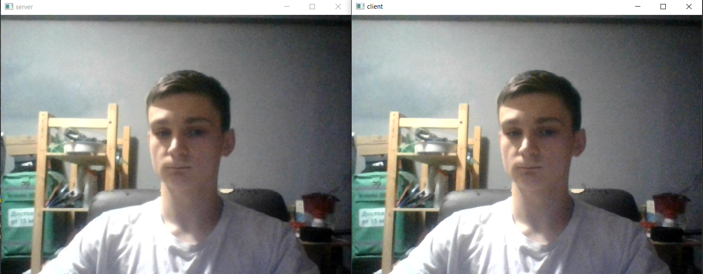

# Взаимодействие Клиент-Сервер
## Стриминг видео с клиента на сервер с помощью protobuf
## Листинг 1 Client
```Py
import cv2
import socket
import video_pb2
import struct

sock = socket.socket(socket.AF_INET, socket.SOCK_STREAM)
# Подключаем сокет к порту, через который прослушивается сервер
server_address = ('localhost', 5252)
print('Подключение к {} порт {}'.format(*server_address))

try:
    sock.connect(server_address)
    print('Подключено')
    vid = cv2.VideoCapture(0)
    message = video_pb2.Video()
    # Отправка данных
    while True:
        ret, frame = vid.read()
        cv2.imshow('client', frame)
        frame = cv2.resize(frame, (400, 400), interpolation=cv2.INTER_AREA)
        _, frame = cv2.imencode('.jpg', frame)
        string_data = frame.tobytes()
        # Заполняем protobuf-сообщение
        message.video_data = string_data

        # Отправляем данные на сервер
        serialized_message = message.SerializeToString()
        sock.sendall(struct.pack("l", len(serialized_message)) + serialized_message)
        if cv2.waitKey(1) & 0xFF == ord('q'):
            break
    vid.release()

except ConnectionRefusedError:
    print('Подключение не установлено, сервер не отвечает')
except ConnectionResetError:
    pass
```

##Листинг 2 Сервер
```Py
import sys
from PySide6.QtWidgets import QApplication
from PySide6.QtNetwork import QTcpServer, QHostAddress
import video_pb2
import numpy as np
import cv2
import struct


class VideoServer:
    def __init__(self):
        self.server = QTcpServer()
        if not self.server.listen(address=QHostAddress.Any, port=5252):
            print("Unable to start the server: %s." % self.server.errorString())
        print('Server started')
        self.message = video_pb2.Video()
        self.server.newConnection.connect(self.new_connection)

    def new_connection(self):
        self.connection = self.server.nextPendingConnection()
        self.connection.readyRead.connect(self.process_frame)
        print(f'Connected to {self.connection}')

    def process_frame(self):
        try:
            # Десериализация protobuf-сообщения
            data = b''
            payload_size = struct.calcsize("l")
            while len(data) < payload_size:
                data += self.connection.read(4).data()
            packed_msg_size = data[:payload_size]
            data = data[payload_size:]
            msg_size = struct.unpack("l", packed_msg_size)[0]
            data += self.connection.readAll().data()
            frame_data = data[:msg_size]
            self.message.ParseFromString(frame_data)
            frame = np.frombuffer(self.message.video_data, dtype=np.byte)
            frame = cv2.imdecode(frame, cv2.IMREAD_UNCHANGED)
            frame = cv2.resize(frame, (800, 600), interpolation=cv2.INTER_AREA)
            cv2.imshow('server', frame)
            cv2.waitKey(1)
        except:
            pass


if __name__ == "__main__":
    app = QApplication(sys.argv)
    video_server = VideoServer()
    sys.exit(app.exec())
```
### Мой результат выполнения программы
Пример работы программы.

### Пояснение
Сначала запускается сервер, далее запускается клиент.
В клиенте происходит считывание изображения с веб-камеры. Далее эти фреймы сжимаются и записываются в protobuf сообщение. 
Сообщение сериализуется в байты и отправляется на сервер вместе с длинной этого сообщения.
Сервер получает сначала длину сообщения, далее он принимает то количество байтов, сколько занимает сообщение и десериализует его обратно во фрейм. Этот фрейм выводится на экран.