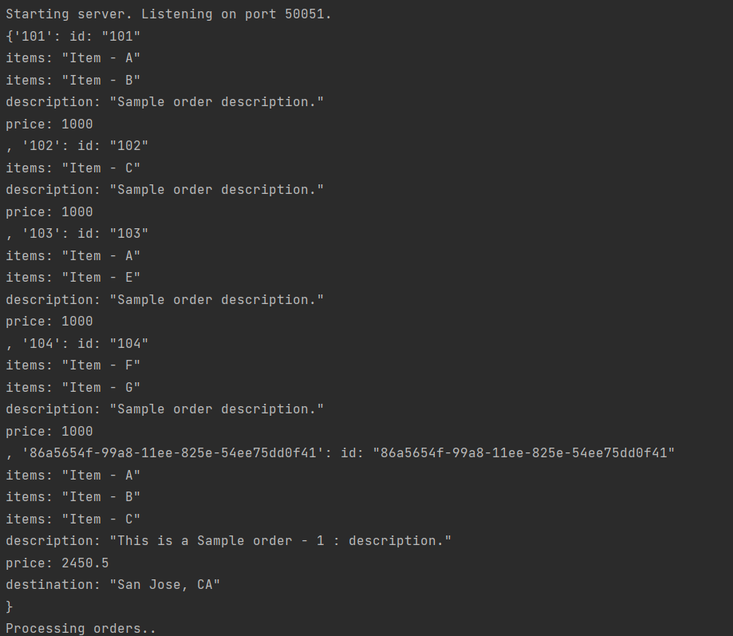
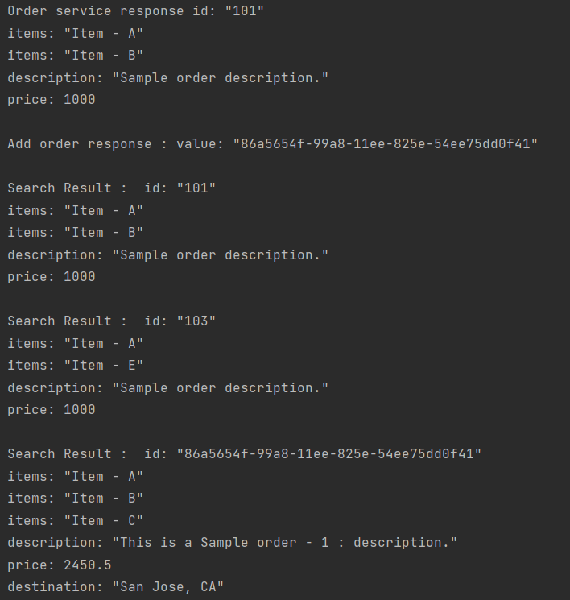

# Взаимодействие Клиент-Сервер с помощью grpc.

## Листинг 1 Server
```Py
from concurrent import futures
import time
from typing import OrderedDict
import uuid
from google.protobuf import wrappers_pb2

import grpc
import order_management_pb2_grpc
import order_management_pb2

class OrderManagementServicer(order_management_pb2_grpc.OrderManagementServicer): 

    def __init__(self):
        self.orderDict = {}
        #Add a sample order 
        self.orderDict['101'] = order_management_pb2.Order(id='101', price=1000, 
                                                           items=['Item - A', 'Item - B'], 
                                                           description='Sample order description.')
        self.orderDict['102'] = order_management_pb2.Order(id='102', price=1000, 
                                                           items=['Item - C'], 
                                                           description='Sample order description.')
        self.orderDict['103'] = order_management_pb2.Order(id='103', price=1000, 
                                                           items=['Item - A', 'Item - E'], 
                                                           description='Sample order description.')
        self.orderDict['104'] = order_management_pb2.Order(id='104', price=1000, 
                                                           items=['Item - F', 'Item - G'], 
                                                           description='Sample order description.')                                                           

    # Unary RPC
    # метод getOrder принимает один запрос с ID заказа и возвращает один ответ, содержащий сообщение Order.
    # На вход в качестве запроса принимает один идентификатор заказа
    # он ищет этот заказ на стороне сервера и возвращает его в виде структуры типа Order.
    def getOrder(self, request, context):
        order = self.orderDict.get(request.value)
        if order is not None: 
            return order
        else: 
            # Error handling 
            print('Order not found ' + request.value)
            context.set_code(grpc.StatusCode.NOT_FOUND)
            context.set_details('Order : ', request.value, ' Not Found.')
            return order_management_pb2.Order()

    # Unary RPC
    # Одиночный вызов. Принимает один запрос и возвращает один ответ. Метод добавляет заказ в словарь заказов.
    def addOrder(self, request, context):
        id = uuid.uuid1()
        request.id = str(id)
        self.orderDict[request.id] = request
        response = wrappers_pb2.StringValue(value=str(id))
        print(self.orderDict)
        return response

    # Server Streaming
    # В ответ на запрос сервер возвращает поток сообщений типа Order
    def searchOrders(self, request, context):  
        matching_orders = self.searchInventory(request.value)
        for order in matching_orders:
            yield order
    
    # Client Streaming
    # Принимает на входе поток данных и возвращает один ответ.
    def updateOrders(self, request_iterator, context):
        response = 'Updated IDs :'
        for order in request_iterator:
            self.orderDict[order.id] = order
            response += ' ' + order.id
        return wrappers_pb2.StringValue(value=response)


    #Bi-di Streaming
    # Сервер принимает поток данных и записывает эти данные в список. Сервер возрвращает этот список в виде потока сообщений типа Order.
    def processOrders(self, request_iterator, context):
        print('Processing orders.. ')
        shipment_id = uuid.uuid1() 
        shipments = []

        shipment = order_management_pb2.CombinedShipment(id=str(shipment_id), status='PROCESSED', )
        shipments.append(shipment)
        for order_id in request_iterator:
            for order in shipments:
                yield order

    # Local function
    # Принимает на вход запрос и возвращает список.
    def searchInventory(self, query):
        matchingOrders = []    
        for order_id, order in self.orderDict.items(): 
            for itm in order.items:
                if query in itm:
                    matchingOrders.append(order)
                    break
        return matchingOrders
 

# Creating gRPC Server
server = grpc.server(futures.ThreadPoolExecutor(max_workers=10))
order_management_pb2_grpc.add_OrderManagementServicer_to_server(OrderManagementServicer(), server)
print('Starting server. Listening on port 50051.')
server.add_insecure_port('[::]:50051')
server.start()
server.wait_for_termination()

```
## Листинг 2 Client
```Py
from google.protobuf import wrappers_pb2
import grpc
import order_management_pb2
import order_management_pb2_grpc

import time


def run():
    # Подключение к серверу на порт 50051
    channel = grpc.insecure_channel('localhost:50051')

    # Создаётм объект класса OrderManagementStub
    stub = order_management_pb2_grpc.OrderManagementStub(channel)

    # Создаём объект класса Order и задаём его атрибуты.
    order1 = order_management_pb2.Order(items=['Item - A', 'Item - B', 'Item - C'],
                                        price=2450.50,
                                        description='This is a Sample order - 1 : description.',
                                        destination='San Jose, CA')

    # Вызываем метод getOrder и передаём в качестве аргумента экземпляр класса Order
    order = stub.getOrder(order_management_pb2.Order(id='101'))
    print("Order service response", order)

    # Unary RPC : Adding an Order
    # Добавляем заказ в словарь на сервере.
    response = stub.addOrder(order1)
    print('Add order response :', response)

    # Server Streaming
    # Сервер возвращает поток данных в ответ на запрос.
    for order_search_result in stub.searchOrders(wrappers_pb2.StringValue(value='Item - A')):
        print('Search Result : ', order_search_result)

    # Client Streaming
    # Клиент передаёт поток данных на сервер, сервер возвращает одно значение.
    upd_order_iterator = generate_orders_for_updates()
    upd_status = stub.updateOrders(upd_order_iterator)
    print('Order update status : ', upd_status)

    # Bi-di Streaming
    # Клиент передаёт поток данных на сервер и в ответ принимает поток данных.
    proc_order_iterator = generate_orders_for_processing()
    for shipment in stub.processOrders(proc_order_iterator):
        print(shipment)

# Генерирует заказы и добавляет их в список. Возвращает список как генератор.
def generate_orders_for_updates():
    ord1 = order_management_pb2.Order(id='101', price=1000,
                                      items=['Item - A', 'Item - B', 'Item - C', 'Item - D'],
                                      description='Sample order description.',
                                      destination='Mountain View, CA')
    ord2 = order_management_pb2.Order(id='102', price=1000,
                                      items=['Item - E', 'Item - Q', 'Item - R', 'Item - D'],
                                      description='Sample order description.',
                                      destination='San Jose, CA')
    ord3 = order_management_pb2.Order(id='103', price=1000,
                                      items=['Item - A', 'Item - K'],
                                      description='Sample order description.',
                                      destination='San Francisco, CA')
    list = []
    list.append(ord1)
    list.append(ord2)
    list.append(ord3)

    for updated_orders in list:
        yield updated_orders

 # Генерирует заказы и добавляет их в список. Возвращает список как генератор.
def generate_orders_for_processing():
    ord1 = order_management_pb2.Order(
        id='104', price=2332,
        items=['Item - A', 'Item - B'],
        description='Updated desc',
        destination='San Jose, CA')
    ord2 = order_management_pb2.Order(
        id='105', price=3000,
        description='Updated desc',
        destination='San Francisco, CA')
    ord3 = order_management_pb2.Order(
        id='106', price=2560,
        description='Updated desc',
        destination='San Francisco, CA')
    ord4 = order_management_pb2.Order(
        id='107', price=2560,
        description='Updated desc',
        destination='Mountain View, CA')
    list = []
    list.append(ord1)
    list.append(ord1)
    list.append(ord3)
    list.append(ord4)

    for processing_orders in list:
        yield processing_orders


run()
```
## Листинг 3 proto-file
```c
syntax = "proto3";

import "google/protobuf/wrappers.proto";

package ecommerce;

service OrderManagement {
    rpc addOrder(Order) returns (google.protobuf.StringValue);
    rpc getOrder(google.protobuf.StringValue) returns (Order);
    rpc searchOrders(google.protobuf.StringValue) returns (stream Order);
    rpc updateOrders(stream Order) returns (google.protobuf.StringValue);
    rpc processOrders(stream google.protobuf.StringValue) returns (stream CombinedShipment);
}

message Order {
    string id = 1;
    repeated string items = 2;
    string description = 3;
    float price = 4;
    string destination = 5;
}

message CombinedShipment {
    string id = 1;
    string status = 2;
    repeated Order ordersList = 3;
}
```
### Результат выполнения программы
Вывод сервера

Вывод клиента
