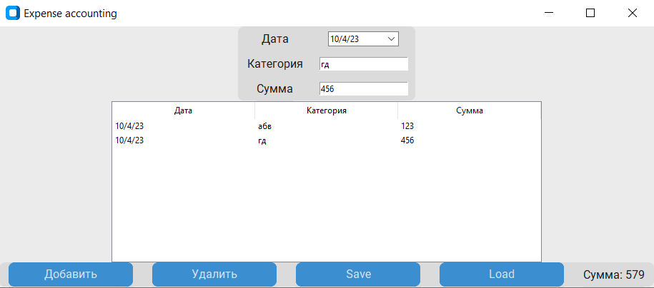

## 1_1
Программа для вывода таблицы расходов.

## Листинг 1_1
```Py
from tkinter import *
from tkinter import ttk

from tkinter import filedialog as fd
from customtkinter import *
import csv
from tkcalendar import DateEntry

set_appearance_mode('Light')


class App(CTk):
    def __init__(self):
        super().__init__()
        self.title('Expense accounting')
        self.sum = 0
        # Создание виджетов
        self.labels = ('Дата', 'Категория', 'Сумма')
        self.frame = CTkFrame(self.master, width=100)
        self.frame2 = CTkFrame(self.master, width=100)
        self.sum_label = CTkLabel(self.frame2, text='Сумма: 0')
        self.frame.grid()

        for index, text in enumerate(self.labels):
            self.label = CTkLabel(self.frame, text=f'{text}')
            self.label.grid(row=index, column=0, padx=10)

        vcd_sum = (self.register(self.validate_sum))
        self.entry_date = DateEntry(self.frame)
        self.entry_category = Entry(self.frame)
        self.entry_sum = Entry(self.frame, validate='key', validatecommand=(vcd_sum, '%P'))

        self.entry_date.grid(row=0, column=1, padx=10)
        self.entry_category.grid(row=1, column=1, padx=10)
        self.entry_sum.grid(row=2, column=1, padx=10)

        self.add_button = CTkButton(master=self.frame2, text='Добавить', command=self.add_expense)
        self.delete_button = CTkButton(master=self.frame2, text='Удалить', command=self.delete_expense)
        self.button_save = CTkButton(master=self.frame2, text='Save', command=self.save_csv)
        self.button_load = CTkButton(master=self.frame2, text='Load', command=self.load_csv)
        self.tree = ttk.Treeview(show="headings", columns=self.labels)

        self.tree.heading(f'{0}', text=self.labels[0], command=lambda: self.sort(0, False))
        self.tree.heading(f'{1}', text=self.labels[1], command=lambda: self.sort(1, False))
        self.tree.heading(f'{2}', text=self.labels[2], command=lambda: self.sort(2, False))
        self.tree.grid()
        self.frame2.grid()
        self.add_button.grid(row=0, column=0, padx=10)
        self.delete_button.grid(row=0, column=1, padx=10)
        self.button_save.grid(row=0, column=2, padx=10)
        self.button_load.grid(row=0, column=3, padx=10)
        self.sum_label.grid(row=0, column=4, padx=10)

    # Валидация ввода суммы
    def validate_sum(self, new_text) -> bool:
        if not new_text:
            return True
        try:
            float(new_text)
            return True
        except ValueError:
            return False

    # Загрузка таблицы из csv файла
    def load_csv(self):
        for i in self.tree.get_children():
            self.tree.delete(i)
        file = fd.askopenfile()
        csvreader = csv.reader(file, delimiter=',')
        for row in csvreader:
            self.tree.insert("", 'end', values=row)
        self.config_sum()

    # Сохранение таблицы в csv файл
    def save_csv(self):
        file = fd.asksaveasfile(filetypes=[("CSV", "*.csv")], defaultextension='csv')
        csvwriter = csv.writer(file, delimiter=',', lineterminator='\r')
        for row_id in self.tree.get_children():
            row = self.tree.item(row_id)['values']
            csvwriter.writerow(row)

    # Сортировка таблицы
    def sort(self, col, reverse):
        l = [(self.tree.set(k, col), k) for k in self.tree.get_children("")]
        l.sort(reverse=reverse)
        for index, (_, k) in enumerate(l):
            self.tree.move(k, "", index)
        self.tree.heading(col, command=lambda: self.sort(col, not reverse))

    # Добавление новой строки в таблицу
    def add_expense(self):
        date = self.entry_date.get()
        category = self.entry_category.get()
        sum = self.entry_sum.get()
        self.tree.insert('', END, values=(date, category, sum))
        self.config_sum()

    # Удаление строки из таблицы
    def delete_expense(self):
        selected_item = self.tree.selection()[0]
        self.tree.delete(selected_item)
        self.config_sum()

    # Изменение общей суммы в таблице
    def config_sum(self):
        sum = 0
        list = self.tree.get_children('')
        for row in list:
            sum += int(self.tree.set(row, 2))
        self.sum_label.configure(text=f'Сумма: {sum}')


if __name__ == '__main__':
    my_app = App()
    my_app.mainloop()
```
### Мой результат выполнения программы


### Пояснение
При запуске открывается окно программы. В три поля вводятся значения. Кнопка "Добавить" добавляет новое значение в таблицу. Кнопка "Удалить" удаляет выбранный элемент из таблицу. Кнопка "Сохранить" открывает окно для выбора пути сохранения таблицу. Кнопка "Загрузить" открывает окно для выбора файла для загрузки. При изменении таблицы меняется общая сумма.
